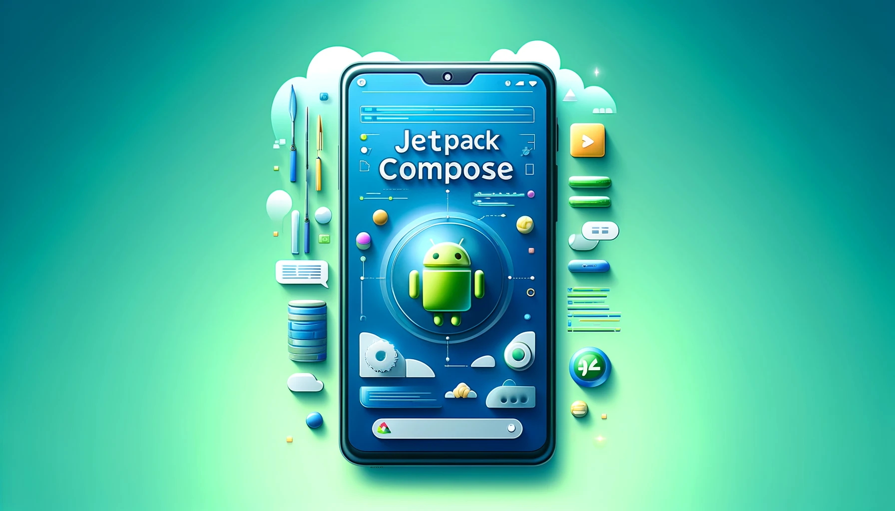
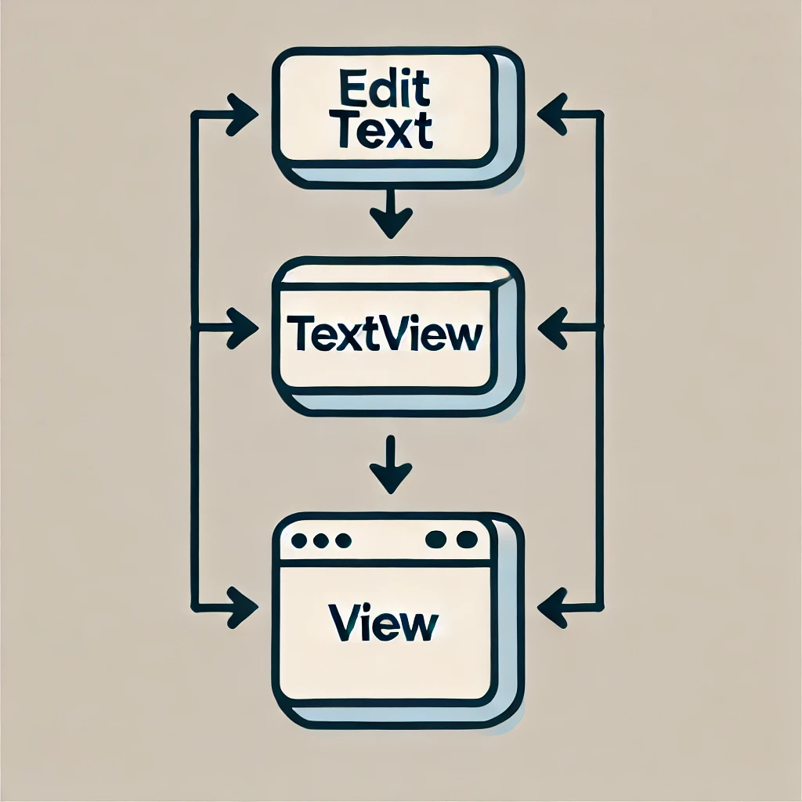

<div align='center'>
    <h1><b>Compose UI</b></h1>
    
</div>

# How Jetpack Compose Redefines Android UI with Kotlin

With Android Jetpack Compose, the way we build UI in Android has completely transformed. Unlike the traditional approach where XML files handle the UI while Kotlin or Java handles the logic, Compose allows you to build both the UI and functionality using a single language Kotlin.

Gone are the days of switching between XML layouts and Java/Kotlin code. In Compose, everything happens in one place, making development faster and more efficient. So why is it called "Compose"?

### Traditional UI: Inheritance-based System
In the old Android UI system, every visual element you added to your screen had to inherit from a base class—View. For example, if you wanted to show text, you'd use TextView, which inherits from View. Similarly, interactive components like EditText also inherit from TextView and ultimately from View.

<div align='center'>
     <h4><b>The hierarchy looked something like this:</b></h4>
    
</div>

### Compose UI: A Shift to Composition
Compose changes this paradigm completely by using a composition-based system instead of inheritance. In Compose, your UI elements don’t inherit from a base class like View. Instead, you "compose" your UI by combining different smaller elements (composables) together. This flexibility allows you to easily build complex UIs by reusing and combining smaller building blocks.

For example, in Compose, creating a text input field or a button is as simple as writing a few lines of Kotlin code, all without the need for XML:

    Text("Hello, World!")
    Button(onClick = { /* Do something */ }) {
       Text("Click Me")
    }

### Benefits of Jetpack Compose:
- **Single Language:** With Jetpack Compose, you no longer need to switch between XML and Kotlin/Java for UI development. Compose allows you to build UIs directly in Kotlin, creating a more unified codebase.<br>
In the example below, a simple UI is defined using Kotlin:
```
    @Composable
    fun SimpleUI() {
        Column(modifier = Modifier.fillMaxSize(), horizontalAlignment = Alignment.CenterHorizontally)   {
            Text(text = "Hello, Compose!")
            Button(onClick = { /* Handle click */ }) {
                Text(text = "Click Me")
            }
    }
```
- **Declarative UI:** Jetpack Compose simplifies the way you build UI by using a declarative approach. Instead of manually updating the UI when data changes, you simply describe what the UI should look like based on its current state, and Compose takes care of rendering it. <br/>
In the example below, we use a Greeting composable to display a greeting message that changes when a button is clicked:
```
    @Composable
    fun Greeting() {
        var name by remember { mutableStateOf("World") }
        Column(modifier = Modifier.fillMaxSize(), horizontalAlignment = Alignment.CenterHorizontally) {
            Text(text = "Hello, $name!")
            Button(onClick = { name = "Compose" }) {
                Text("Change Name")
            }
        }
    }
```
In this code, we use `remember` to create a `name` state variable initialized to "World." This keeps the value consistent across recompositions. The `Text` composable displays the current `name`, and when the button is clicked, the `onClick` lambda updates it to "Compose," automatically reflecting the change in the UI.
- **Simpler Customization:** Jetpack Compose simplifies UI element customization by allowing you to modify components directly using Kotlin functions. Unlike traditional methods that often require extending classes or creating custom XML layouts, Compose enables quick and easy adjustments with modifiers. <br/>
For example, you can create a custom button with just a few lines of code by applying modifiers such as `padding`, `border`, and `background` color.
```
    @Composable
    fun CustomButton(text: String, onClick: () -> Unit) {
        Button(
            onClick = onClick,
            modifier = Modifier
                .padding(16.dp)
                .border(2.dp, Color.Blue, shape = RoundedCornerShape(8.dp))
                .background(Color.Yellow)
        ) {
            Text(text = text)
        }
    }
    
    @Composable
    fun CustomUI() {
        Column(modifier = Modifier.fillMaxSize(), horizontalAlignment = Alignment.CenterHorizontally) {
            CustomButton(text = "Custom Button") {
                // Handle button click
            }
        }
    }
```
<br/>
To conclude, Jetpack Compose is more than just a new way to build UIs—it’s a game changer for Android development. By moving away from XML layouts and embracing a composition model, Compose makes the development process easier and more flexible, allowing developers to build dynamic UIs with less code. Its modern, declarative approach is set to become the standard for Android apps. <br/><br/>
There's much more to explore! In upcoming posts, we'll cover advanced topics like effective state management, and how to migrate existing projects to Jetpack Compose. Stay tuned for <b>Part 2!</b>
